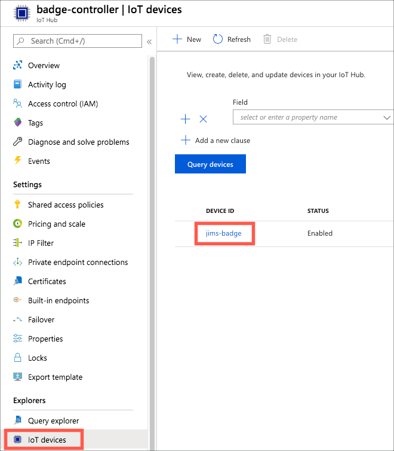
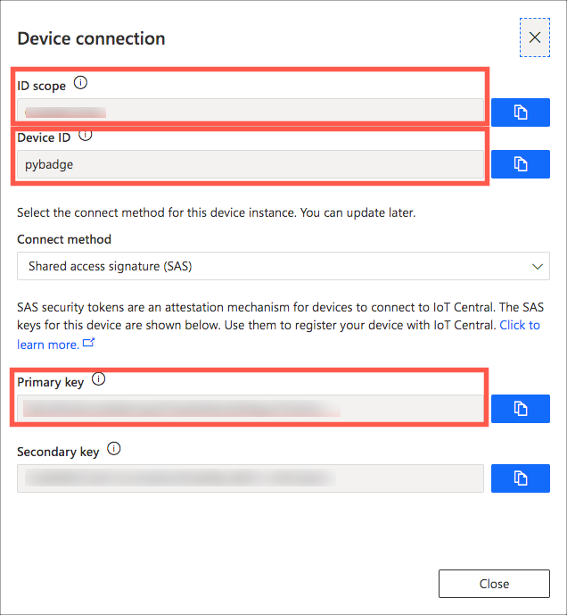

Adafruit_CircuitPython_AzureIoT
================================

.. image:: https://readthedocs.org/projects/adafruit-circuitpython-azureiot/badge/?version=latest
    :target: https://docs.circuitpython.org/projects/azureiot/en/latest/
    :alt: Documentation Status

.. image:: https://img.shields.io/discord/327254708534116352.svg
    :target: https://adafru.it/discord
    :alt: Discord

.. image:: https://github.com/adafruit/Adafruit_CircuitPython_AzureIoT/workflows/Build%20CI/badge.svg
    :target: https://github.com/adafruit/Adafruit_CircuitPython_AzureIoT/actions/
    :alt: Build Status

A CircuitPython device library for `Microsoft Azure IoT Services <https://azure.microsoft.com/overview/iot/?WT.mc_id=academic-3168-jabenn>`_ from a CircuitPython device. This library only supports key-base authentication, it currently doesn't support X.509 certificates.

Installing from PyPI
=====================
On supported GNU/Linux systems like the Raspberry Pi, you can install the driver locally `from
PyPI <https://pypi.org/project/adafruit-circuitpython-azureiot/>`_. To install for current user:

.. code-block:: shell

    pip3 install adafruit-circuitpython-azureiot

To install system-wide (this may be required in some cases):

.. code-block:: shell

    sudo pip3 install adafruit-circuitpython-azureiot

To install in a virtual environment in your current project:

.. code-block:: shell

    mkdir project-name && cd project-name
    python3 -m venv .env
    source .env/bin/activate
    pip3 install adafruit-circuitpython-azureiot

Dependencies
=============
This driver depends on:

* `Adafruit CircuitPython <https://github.com/adafruit/circuitpython>`_
* `Adafruit CircuitPython MiniMQTT <https://github.com/adafruit/Adafruit_CircuitPython_MiniMQTT>`_
* `Adafruit CircuitPython Requests <https://github.com/adafruit/Adafruit_CircuitPython_Requests>`_
* `Adafruit CircuitPython BinASCII <https://github.com/adafruit/Adafruit_CircuitPython_Binascii>`_

Please ensure all dependencies are available on the CircuitPython filesystem.
This is easily achieved by downloading
`the Adafruit library and driver bundle <https://github.com/adafruit/Adafruit_CircuitPython_Bundle>`_.

Usage Example
=============

This library supports both `Azure IoT Hub <https://azure.microsoft.com/services/iot-hub/?WT.mc_id=academic-3168-jabenn>`_ and `Azure IoT Central <https://azure.microsoft.com/services/iot-central/?WT.mc_id=academic-3168-jabenn>`__.

To create an Azure IoT Hub instance or an Azure IoT Central app, you will need an Azure subscription. If you don't have an Azure subscription, you can sign up for free:

- If you are a student 18 or over, head to `aka.ms/FreeStudentAzure <https://aka.ms/FreeStudentAzure>`_ and sign up, validating with your student email address. This will give you $100 of Azure credit and free tiers of a load of service, renewable each year you are a student. You will not need a credit card.

- If you are not a student, head to `aka.ms/FreeAz <https://aka.ms/FreeAz>`_ and sign up to get $200 of credit for 30 days, as well as free tiers of a load of services. You will need a credit card for validation only, your card will not be charged.

ESP32 AirLift Networking
========================

To use this library, you will need to create an ESP32_SPI WifiManager, connected to WiFi. You will also need to set the current time, as this is used to generate time-based authentication keys. One way to do this is via the `Adafruit CircuitPython NTP <https://github.com/adafruit/Adafruit_CircuitPython_NTP>`_ library with the following code:

.. code-block:: python

    ntp = NTP(esp)

    # Wait for a valid time to be received
    while not ntp.valid_time:
        time.sleep(5)
        ntp.set_time()

Native Networking
=================
To use this library, with boards that have native networking support, you need to be connected to a network. You will also need to set the current time, as this is used to generate time-based authentication keys. One way to do this is by using the `Adafruit IoT Time API <https://io.adafruit.com/api/docs/#time>`_ via the `Adafruit Requests library <https://github.com/adafruit/Adafruit_CircuitPython_Requests>`_ with the following code:

.. code-block:: python

    pool = socketpool.SocketPool(wifi.radio)
    requests = adafruit_requests.Session(pool, ssl.create_default_context())
    response = requests.get("https://io.adafruit.com/api/v2/time/seconds")
    if response:
        if response.status_code == 200:
            r = rtc.RTC()
            r.datetime = time.localtime(int(response.text))
            print(f"System Time: {r.datetime}")
        else:
            print("Setting time failed")

Azure IoT Hub
-------------

To interact with Azure IoT Hub, you will need to create a hub, and a register a device inside that hub. There is a free tier available, and this free tier allows up to 8,000 messages a day, so try not to send messages too often if you are using this tier.

- Open the `Azure Portal <https://aka.ms/AzurePortalHome>`_.
- Follow the instructions in `Microsoft Docs <https://aka.ms/CreateIoTHub>`_ to create an Azure IoT Hub and register a device.
- Copy the devices Primary or secondary connection string, and add this to your ``secrets.py`` file.

You can find the device connection string by selecting the IoT Hub in the `Azure Portal <https://aka.ms/AzurePortalHome>`_, *selecting Explorer -> IoT devices*, then selecting your device.

*Locating the device in the IoT hub blade*

Then copy either the primary or secondary connection string using the copy button next to the value.

.. image:: iot-hub-device-keys.png
   :alt: Copy the primary connection string

*Copy the primary connection string*

**Connect your device to Azure IoT Hub**

.. code-block:: python

    from adafruit_azureiot import IoTHubDevice

    device = IoTHubDevice(wifi, secrets["device_connection_string"])
    device.connect()

Once the device is connected, you will regularly need to run a ``loop`` to poll for messages from the cloud.

.. code-block:: python

    while True:
        device.loop()
        time.sleep(1)

**Send a device to cloud message**

.. code-block:: python

    message = {"Temperature": temp}
    device.send_device_to_cloud_message(json.dumps(message))

**Receive device to cloud messages**

.. code-block:: python

    def cloud_to_device_message_received(body: str, properties: dict):
        print("Received message with body", body, "and properties", json.dumps(properties))

    # Subscribe to cloud to device messages
    device.on_cloud_to_device_message_received = cloud_to_device_message_received

**Receive direct methods**

.. code-block:: python

    def direct_method_invoked(method_name: str, payload) -> IoTResponse:
        print("Received direct method", method_name, "with data", str(payload))
        # return a status code and message to indicate if the direct method was handled correctly
        return IoTResponse(200, "OK")

    # Subscribe to direct methods
    device.on_direct_method_invoked = direct_method_invoked

**Update reported properties on the device twin**

*This is not supported on Basic tier IoT Hubs, only on the free and standard tiers.*

.. code-block:: python

    patch = {"Temperature": temp}
    device.update_twin(patch)

**Subscribe to desired property changes on the device twin**

*This is not supported on Basic tier IoT Hubs, only on the free and standard tiers.*

.. code-block:: python

    def device_twin_desired_updated(desired_property_name: str, desired_property_value, desired_version: int):
        print("Property", desired_property_name, "updated to", str(desired_property_value), "version", desired_version)

    # Subscribe to desired property changes
    device.on_device_twin_desired_updated = device_twin_desired_updated

Azure IoT Central
-----------------

To use Azure IoT Central, you will need to create an Azure IoT Central app, create a device template and register a device against the template.

- Head to `Azure IoT Central <https://apps.azureiotcentral.com/?WT.mc_id=academic-3168-jabenn>`__
- Follow the instructions in the `Microsoft Docs <https://docs.microsoft.com/azure/iot-central/core/quick-deploy-iot-central?WT.mc_id=academic-3168-jabenn>`__ to create an application. Every tier is free for up to 2 devices.
- Follow the instructions in the `Microsoft Docs <https://docs.microsoft.com/azure/iot-central/core/quick-create-simulated-device?WT.mc_id=academic-3168-jabenn>`__ to create a device template.
- Create a device based off the template, and select **Connect** to get the device connection details. Store the ID Scope, Device ID and either the primary or secondary device SAS key in your ``secrets.py`` file.

.. image:: iot-central-connect-button.png
   :alt: The IoT Central connect button

*The connect button*

*The connection details dialog*

.. code-block:: python

    secrets = {
        # WiFi settings
        "ssid": "",
        "password": "",

        # Azure IoT Central settings
        "id_scope": "",
        "device_id": "",
        "device_sas_key": ""
    }

**Connect your device to your Azure IoT Central app**

.. code-block:: python

    from adafruit_azureiot import IoTCentralDevice

    device = IoTCentralDevice(wifi, secrets["id_scope"], secrets["device_id"], secrets["device_sas_key"])
    device.connect()

Once the device is connected, you will regularly need to run a ``loop`` to poll for messages from the cloud.

.. code-block:: python

    while True:
        device.loop()
        time.sleep(1)

**Send telemetry**

.. code-block:: python

    message = {"Temperature": temp}
    device.send_telemetry(json.dumps(message))

**Listen for commands**

.. code-block:: python

    def command_executed(command_name: str, payload) -> IoTResponse:
        print("Command", command_name, "executed with payload", str(payload))
        # return a status code and message to indicate if the command was handled correctly
        return IoTResponse(200, "OK")

    # Subscribe to commands
    device.on_command_executed = command_executed

**Update properties**

.. code-block:: python

    device.send_property("Desired_Temperature", temp)

**Listen for property updates**

.. code-block:: python

    def property_changed(property_name, property_value, version):
        print("Property", property_name, "updated to", str(property_value), "version", str(version))

    # Subscribe to property updates
    device.on_property_changed = property_changed

Learning more about Azure IoT services
--------------------------------------

If you want to learn more about setting up or using Azure IoT Services, check out the following resources:

- `Azure IoT documentation on Microsoft Docs <https://docs.microsoft.com/azure/iot-fundamentals/?WT.mc_id=academic-3168-jabenn>`_
- `IoT learning paths and modules on Microsoft Learn <https://docs.microsoft.com/learn/browse/?term=iot&WT.mc_id=academic-3168-jabenn>`_ - Free, online, self-guided hands on learning with Azure IoT services

Documentation
=============

API documentation for this library can be found on `Read the Docs <https://docs.circuitpython.org/projects/azureiot/en/latest/>`_.

For information on building library documentation, please check out `this guide <https://learn.adafruit.com/creating-and-sharing-a-circuitpython-library/sharing-our-docs-on-readthedocs#sphinx-5-1>`_.

Contributing
============

Contributions are welcome! Please read our `Code of Conduct
<https://github.com/adafruit/Adafruit_CircuitPython_AzureIoT/blob/main/CODE_OF_CONDUCT.md>`_
before contributing to help this project stay welcoming.
